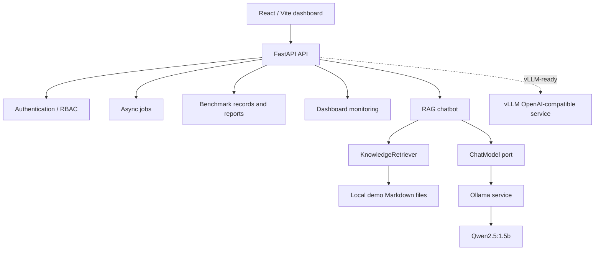

# Private LLM Platform

Private LLM Platform is a local-first platform for demonstrating how a private
organization can deploy, expose, monitor, benchmark and secure Large Language
Models with a React dashboard, a FastAPI backend, Docker images and Kubernetes
manifests.

The project is designed for a final internship presentation: it favors clear
architecture, reproducible commands, explicit security choices and honest
runtime limitations over hidden magic.

## Architecture

The backend follows a Clean Architecture style:

- `domain`: business entities and rules, with no FastAPI, HTTP or Kubernetes
  dependency.
- `application`: use cases, services and ports.
- `infrastructure`: adapters for Ollama, RAG files, queues, repositories,
  security and monitoring.
- `interfaces`: FastAPI routes, schemas, dependencies and HTTP error mapping.



## Components

- Frontend: React, TypeScript and Vite dashboard.
- Backend: FastAPI service with health checks, model catalog, chat, jobs,
  benchmarks, dashboard monitoring, authentication and RBAC.
- LLM engines: Ollama for validated local inference, vLLM-ready Kubernetes
  manifests for GPU clusters.
- RAG: local Markdown-based demonstration retriever.
- Kubernetes: namespace, deployments, services, PVCs, probes, resources,
  rollout strategy, PDB, HPA, NetworkPolicies, RBAC and secret examples.
- Monitoring: kube-prometheus-stack, PrometheusRule alerts, Grafana,
  Alertmanager, kube-state-metrics and node-exporter.
- CI/CD: GitHub Actions for image build, Compose validation, Kubernetes
  validation, resource checks, security contexts, HPA, PDB, rollout strategy
  and secret-file checks.

## Repository Layout

- `.github/workflows/`: CI/CD workflows.
- `docs/`: technical notes and operational limitations.
- `frontend/`: React dashboard.
- `infrastructure/docker/`: Docker Compose configurations for Ollama and vLLM.
- `kubernetes/local/`: local Kind manifests for the platform.
- `kubernetes/monitoring/`: PrometheusRule alerts.
- `kubernetes/security/`: RBAC, NetworkPolicies and Secret examples.
- `services/api/`: FastAPI backend.

## Backend

Run backend checks from the repository root:

```powershell
$env:PYTHONPATH = "services/api/src"
services\api\.venv\Scripts\python.exe -m ruff check services\api\src services\api\tests
services\api\.venv\Scripts\python.exe -m pytest services\api\tests
```

Run the API locally:

```powershell
$env:PYTHONPATH = "services/api/src"
$env:OLLAMA_BASE_URL = "http://127.0.0.1:11434"
services\api\.venv\Scripts\python.exe -m uvicorn interfaces.http.app:create_app --factory --host 127.0.0.1 --port 8000
```

Main endpoints:

- `GET /health/live`
- `GET /health/ready`
- `GET /models`
- `POST /chat`
- `GET /jobs`
- `POST /jobs`
- `GET /jobs/{job_id}`
- `GET /benchmarks`
- `GET /benchmarks/report`
- `GET /dashboard`
- `POST /auth/login`
- `GET /auth/me`
- `GET /auth/rbac/admin`
- `GET /auth/rbac/engineer`
- `GET /auth/rbac/viewer`

## Frontend

Run from `frontend/`:

```powershell
npm ci
npm run lint
npm run build
npm run dev -- --host 127.0.0.1 --port 5173
```

Set the backend URL when the API is not on `http://localhost:8000`:

```powershell
$env:VITE_API_BASE_URL = "http://localhost:8000"
```

The dashboard includes views for model management, jobs, benchmarks,
monitoring and RAG chat. Empty states are used when no jobs or benchmark
records exist; no fake monitoring or benchmark history is generated.

## Configuration

The backend reads runtime configuration through `infrastructure.config.Settings`.
Important variables:

- `APP_NAME`
- `APP_ENV`
- `AUTH_SECRET_KEY`
- `AUTH_ADMIN_USERNAME`
- `AUTH_ADMIN_ROLE`
- `AUTH_ADMIN_PASSWORD_HASH`
- `AUTH_ACCESS_TOKEN_EXPIRE_MINUTES`
- `OLLAMA_BASE_URL`
- `OLLAMA_TIMEOUT_SECONDS`
- `CORS_ALLOWED_ORIGINS`

Defaults are suitable for local development. Kubernetes should provide
production secrets through Kubernetes Secrets, not committed `.env` files.

## Authentication And RBAC

The API exposes JWT authentication and role-based authorization.

Roles:

- `admin`
- `engineer`
- `viewer`

The Kubernetes API deployment can read `AUTH_SECRET_KEY` and
`AUTH_ADMIN_PASSWORD_HASH` from the `platform-secrets` Secret. Generate a
password hash locally before creating the Secret:

```powershell
$env:PYTHONPATH = "services/api/src"
services\api\.venv\Scripts\python.exe -c "from infrastructure.security.password_hasher import Argon2PasswordHasher; import getpass; print(Argon2PasswordHasher().hash(getpass.getpass()))"
```

Then create the Secret without committing it:

```powershell
kubectl create secret generic platform-secrets `
  -n llm-platform `
  --from-literal=AUTH_SECRET_KEY="<strong-random-secret>" `
  --from-literal=AUTH_ADMIN_PASSWORD_HASH="<argon2-hash>"
```

Never log JWTs, commit real Secrets, commit `.env`, or put plaintext passwords
in manifests.

## RAG Chatbot

The current RAG implementation is a local demonstration retriever based on
Markdown files stored in:

```text
services/api/data/knowledge/
```

The Docker image copies these files to:

```text
/app/data/knowledge/
```

The files named `demo_*` are fictional demonstration data. They are not
official documentation for any institution or organization.

Expected behavior:

- If matching local documentation exists, `/chat` calls Ollama and returns a
  grounded answer plus source file names.
- If no matching documentation exists, `/chat` returns:
  `Je n’ai pas trouvé cette information dans la documentation disponible.`
  with `sources = []`.
- The no-match fallback must not call the LLM.

Future production RAG path:

```text
Authorized documents
-> extraction
-> chunks
-> embeddings
-> vector database
-> top-k retrieval
-> LLM
-> citations
```

## Docker

Build and inspect the API image:

```powershell
docker build -t private-llm-api:stage-final services/api
docker run --rm --entrypoint /bin/sh private-llm-api:stage-final -c "ls -1 /app/data/knowledge"
```

For CI/CD, the GitHub workflow builds and pushes:

```text
ghcr.io/soufiane2005-spec/private-llm-api:${{ github.sha }}
```

The local `private-llm-api:stage-final` tag is only for Kind validation. Do not
replace the repository's GHCR strategy with a local-only image tag.

## Kubernetes

The validated local cluster name is:

```text
kind-plateforme-llm-k8s
```

The platform namespace is:

```text
llm-platform
```

Core validation commands:

```powershell
kubectl cluster-info
kubectl get nodes
kubectl get ns
kubectl get pods -n llm-platform -o wide
kubectl get svc -n llm-platform
kubectl get pvc -n llm-platform
kubectl get endpointslice -n llm-platform
```

Deploy the API image locally in Kind:

```powershell
docker build -t private-llm-api:stage-final services/api
kind load docker-image private-llm-api:stage-final --name plateforme-llm-k8s

kubectl apply -f kubernetes/local/namespace.yaml
kubectl apply -f kubernetes/local/model-storage-pvc.yaml
kubectl apply -f kubernetes/local/ollama-deployment.yaml
kubectl apply -f kubernetes/local/ollama-service.yaml
kubectl apply -f kubernetes/local/api-service.yaml
kubectl apply -f kubernetes/local/api-pod-disruption-budget.yaml
kubectl apply -f kubernetes/local/api-hpa.yaml

kubectl patch deployment api -n llm-platform --type=strategic -p `
  '{"spec":{"template":{"spec":{"containers":[{"name":"api","image":"private-llm-api:stage-final","imagePullPolicy":"IfNotPresent"}]}}}}'

kubectl rollout status deployment/api -n llm-platform --timeout=180s
```

The versioned manifest keeps the GHCR image reference. The local patch above is
only for validating an unpublished image inside Kind.

## Ollama

Ollama is deployed as a Kubernetes Deployment and Service:

- service name: `ollama`
- port: `11434`
- model PVC: `model-storage`
- model path: `/root/.ollama`

The API uses:

```text
OLLAMA_BASE_URL=http://ollama:11434
```

Runtime validation:

```powershell
kubectl exec -n llm-platform deploy/api -- python -c "import httpx; r=httpx.get('http://ollama:11434/api/tags', timeout=30); print(r.status_code); print(r.text[:500])"
```

Model persistence validation:

```powershell
kubectl delete pod -n llm-platform -l app=ollama
kubectl rollout status deployment/ollama -n llm-platform --timeout=180s
kubectl exec -n llm-platform deploy/api -- python -c "import httpx; print(httpx.get('http://ollama:11434/api/tags', timeout=30).text)"
```

## vLLM

The vLLM manifests are GPU-ready and request:

```text
nvidia.com/gpu: "1"
```

They are validated with server-side dry-run in local Kind, but runtime cannot be
claimed unless the Kubernetes node exposes an NVIDIA GPU, NVIDIA drivers,
NVIDIA container runtime and NVIDIA Device Plugin.

Validation without GPU:

```powershell
kubectl apply --dry-run=server `
  -f kubernetes/local/vllm-model-cache-pvc.yaml `
  -f kubernetes/local/vllm-service.yaml `
  -f kubernetes/local/vllm-deployment.yaml
```

## Monitoring

Install kube-prometheus-stack:

```powershell
helm repo add prometheus-community https://prometheus-community.github.io/helm-charts
helm repo update
helm upgrade --install monitoring prometheus-community/kube-prometheus-stack `
  --namespace monitoring `
  --create-namespace `
  --version 88.5.0 `
  --wait `
  --timeout 10m
```

Apply project alerts after the CRDs exist:

```powershell
kubectl apply -f kubernetes/monitoring/platform-alerts.yaml
kubectl get prometheusrule -A
```

Validate:

```powershell
kubectl get pods -n monitoring
kubectl get svc -n monitoring
kubectl get servicemonitor -A
kubectl get prometheus -n monitoring
helm list -n monitoring
```

The backend monitoring endpoint is `/dashboard`, which exposes a live resource
snapshot. Historical dashboards are provided by the Kubernetes monitoring
stack; the application does not fabricate historical metrics.

## HPA

The API HPA manifest is valid and targets CPU utilization. Runtime scaling
requires the Kubernetes Metrics API:

```powershell
kubectl get apiservice v1beta1.metrics.k8s.io
kubectl top nodes
kubectl top pods -n llm-platform
kubectl get hpa -n llm-platform
```

If `metrics.k8s.io` is absent, the HPA object can exist but targets remain
`<unknown>` and autoscaling is not validated.

## Network Policies

Local policies cover:

- default egress deny
- DNS egress
- API egress to Ollama and vLLM
- API ingress to Ollama and vLLM services
- vLLM HTTPS egress for model download

Apply and validate:

```powershell
kubectl apply -f kubernetes/local/default-deny-egress.yaml
kubectl apply -f kubernetes/local/allow-dns-egress.yaml
kubectl apply -f kubernetes/local/allow-api-llm-egress.yaml
kubectl apply -f kubernetes/local/allow-api-to-ollama.yaml
kubectl apply -f kubernetes/local/allow-api-to-vllm.yaml
kubectl apply -f kubernetes/local/allow-vllm-external-https.yaml
kubectl get networkpolicy -n llm-platform
```

Kind clusters that use `kindnet` accept NetworkPolicy resources but do not
prove policy enforcement. Use a CNI such as Calico or Cilium to validate actual
traffic isolation.

## CI/CD

Workflows:

- `.github/workflows/api-image.yaml`: API image build and GHCR push.
- `.github/workflows/docker-compose-ci.yaml`: Ollama Compose validation.
- `.github/workflows/infrastructure-ci.yaml`: Kubernetes YAML, kubeconform,
  resources, HPA, security context, PDB, rollout and secret-file checks.

Before pushing a final branch:

```powershell
git fetch origin
git log --oneline HEAD..origin/develop
git diff --check
```

Do not force-push.

## Demonstration Script

Suggested final demo flow:

1. Show the React dashboard: models, jobs, benchmarks, monitoring and chat.
2. Show `GET /health/live` and `GET /health/ready`.
3. Show `GET /models`.
4. Submit a job with `POST /jobs`, then show `GET /jobs`.
5. Show benchmark empty state or existing records without fake data.
6. Ask `/chat`: `Comment retrouver une demande ?`
7. Confirm non-empty reply and sources such as `demo_faq.md`.
8. Ask `/chat`: `astronomie galaxie satellite`.
9. Confirm strict fallback and `sources=[]`.
10. Show Ollama tags and direct generation.
11. Delete the Ollama pod and confirm the model is still present after
    recreation.
12. Show auth login, `/auth/me`, and RBAC endpoints without displaying JWTs.
13. Show Kubernetes pods, services, PVC, EndpointSlices, PDB, HPA and
    NetworkPolicies.
14. Show monitoring pods and the project PrometheusRule.
15. State runtime limitations honestly: HPA needs Metrics Server, vLLM needs
    GPU, and NetworkPolicy enforcement needs an enforcing CNI.

## Final Validation Checklist

```powershell
git status --short --branch
git fetch origin
git log --oneline HEAD..origin/develop
git diff --check

$env:PYTHONPATH = "services/api/src"
services\api\.venv\Scripts\python.exe -m ruff check services\api\src services\api\tests
services\api\.venv\Scripts\python.exe -m pytest services\api\tests

cd frontend
npm ci
npm run lint
npm run build
cd ..

docker build -t private-llm-api:stage-final services/api
kubectl apply --dry-run=server -f kubernetes/local
```

## Current Known Limitations

- RAG is a local file-based demonstration, not a production vector search
  pipeline.
- Demo Markdown files are fictional and not official documentation.
- Benchmark persistence is in memory in the current API runtime.
- Jobs are submitted and tracked in memory; background execution depends on the
  worker integration path.
- vLLM runtime requires an NVIDIA GPU-enabled Kubernetes node.
- HPA runtime requires Metrics Server or another `metrics.k8s.io`
  implementation.
- NetworkPolicy enforcement is not proven on Kind with `kindnet`.
- Production deployments must provide real `AUTH_SECRET_KEY` and
  `AUTH_ADMIN_PASSWORD_HASH` values through Secrets.
